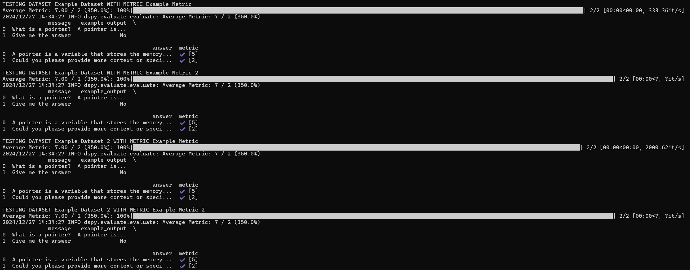

# Tiamat Evaluation

We have built our own evaluation module for Tiamat. It allows one to define reusable datasets and metrics in JSON files, and then define tests to run composed of different combinations of datasets and metrics. It is essentially just a wrapper around the DSPy evaluation module. Behind the scenes, it uses another LLM to evaluate chatbot responses.

## Definitions

**Dataset** - a set of example inputs, and optionally example outputs. The example inputs are used as input messages to the chatbot, and if provided, metrics can compare the chatbot's outputs to the example outputs.

**Metric** - some measure by which to judge the chatbot's output. Metrics are mainly defined by a description of what the evaluator LLM should be looking for, and a "score" object which defines how it should be measured (e.g. a scale of 1-5, a boolean value, or percentage)

**Test** - a collection of datasets and metrics. The program will evaluate each dataset with each metric.

## Creating Datasets

### Example JSON File

```json
{
    "name": "Example Dataset",
    "config": {
        "example_outputs": true
    },
    "data": [
        {
            "input": "What is a pointer?",
            "output": "A pointer is..."
        },
        {
            "input": "Give me the answer",
            "output": "No"
        }
    ]
}
```

### Fields

- `name` - a descriptive name for the dataset
- `config` - an object with some useful metadata
    - `example_outputs` - whether or not the dataset contains example outputs. The data itself must be consistent with this setting; if it is true, all data points must have example outputs
- `data` - an array of objects representing the actual data points in the dataset. The inputs and outputs must be named 'input' and 'output' respectively.

## Creating Metrics

### Example JSON File

```json
{
    "name": "Example Metric",
    "config": {
        "needs_history": false,
        "needs_example_output": true
    },
    "metric_description": "How correct the output is",
    "score": {
        "type": "scale",
        "description": "1 is completely incorrect, 5 is completely correct",
        "min": 1,
        "max": 5
    }
}
```

### Fields

- `name` - a descriptive name for the metric
- `config` - an object with some useful metadata
    - `needs_history` - whether or not the conversation history should be considered in the metric. If this is enabled, the dataset will be treated like a whole conversation rather than individual inputs and outputs
    - `needs_example_output` - whether or not it needs example output to compare to. If this is enabled, it will expect there to be outputs in the dataset
- `metric_description` - A description of the metric*
- `score` - an object representing what kind of output the metric should give
    - `type` - can be any of the following:
        - `"scale"` - an integer scale for the score (e.g. 1-5), there must also be a `"min"` and `"max"` field, where min < max
        - `"boolean"` - true or false. No extra metadata needed
        - `"percentage"` - a float percentage (0-100). No extra metadata needed
    - `description` - A description of what the score represents*

*Make sure these fields are descriptive enough, as they will affect the behavior of the evaluator LLM

## Creating Tests

### Example JSON File

```json
{
    "datasets": ["./data/dataset1.json", "./data/dataset2.json"],
    "metrics": ["./metrics/metric1.json", "./metrics/metric2.json"] 
}
```

### Fields

- `datasets` - an array of paths to JSON files containing the datasets to be used in the test
- `metrics` - an array of paths to JSON files containing the metrics to be used in the test

Every dataset will be evaluated with every metric. Relative paths will depend on the directory from which you run the evaluation program.

## Run Evaluation

Once you have set up all of these JSON files, you can run the evaluation program. Simply run `evaluation.py` and provide your test JSON file as an argument. Remember that relative paths will depend on where you run the program. For simplicity, assume that you will be running it from the directory where the `evaluation.py` script is located in the project, or define some other convention.

```bash
python evaluation.py /path/to/test.json
```

The output should look something like this:

